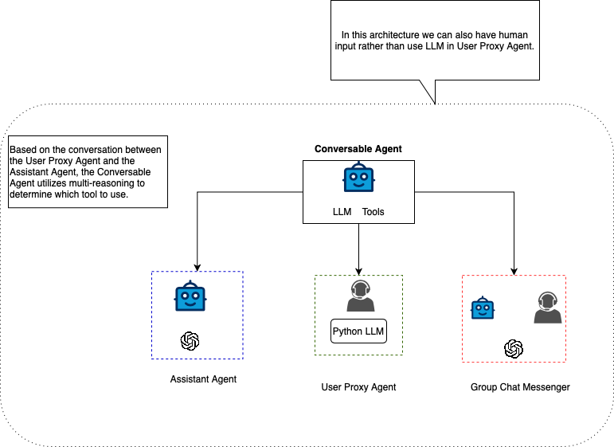

a multi-reasoning approach where a **Conversable Agent** determines which tool to use based on a conversation between a **User Proxy Agent** and an **Assistant Agent**. Here's a structured approach to implementing this:

---





### **System Components:**
1. **User Proxy Agent (UPA)**  
   - Acts as an intermediary between the user and the system.  
   - Extracts intent from user queries.  
   - Passes structured queries to the Assistant Agent.

2. **Assistant Agent (AA)**  
   - Processes the structured query using reasoning.  
   - Evaluates possible solutions and available tools.  
   - Provides multiple reasoning paths for decision-making.

3. **Conversable Agent (CA)**  
   - Receives multi-reasoning outputs from AA.  
   - Decides which tool (API, model, database, etc.) to use based on confidence levels.  
   - Executes the tool and returns results to UPA.

---

### **Workflow:**
1. **User Inputs Query**  
   - Example: *"Summarize this document and extract key topics."*  

2. **User Proxy Agent (UPA) Processes Intent**  
   - Converts the query into structured intent:  
     ```json
     {
       "task": "summarization",
       "input_type": "document",
       "output_type": ["summary", "key_topics"]
     }
     ```

3. **Assistant Agent (AA) Generates Reasoning Paths**  
   - **Path 1:** Use an **LLM** to summarize and extract key topics.  
   - **Path 2:** Use an **embedding model** for topic clustering, then summarize.  
   - **Path 3:** Use **statistical NLP techniques** for key phrase extraction.

4. **Conversable Agent (CA) Selects the Best Tool**  
   - Evaluates reasoning paths using a scoring function.  
   - Example criteria: **accuracy, speed, cost, and reliability.**  
   - If **Path 1 (LLM-based)** has the highest confidence, it invokes an **LLM API**.

5. **Execution & Response**  
   - CA calls the selected tool (e.g., GPT, a vector database, or a Python script).  
   - The response is structured and returned to UPA.  
   - UPA formats the response and sends it to the user.


---

### **Key Benefits of This Approach**
- **Multi-Reasoning:** Evaluates different solution paths before selecting a tool.  
- **Dynamic Tool Selection:** Adapts based on task complexity and resource constraints.  
- **Scalability:** Can be extended to include more tools and agents.  
